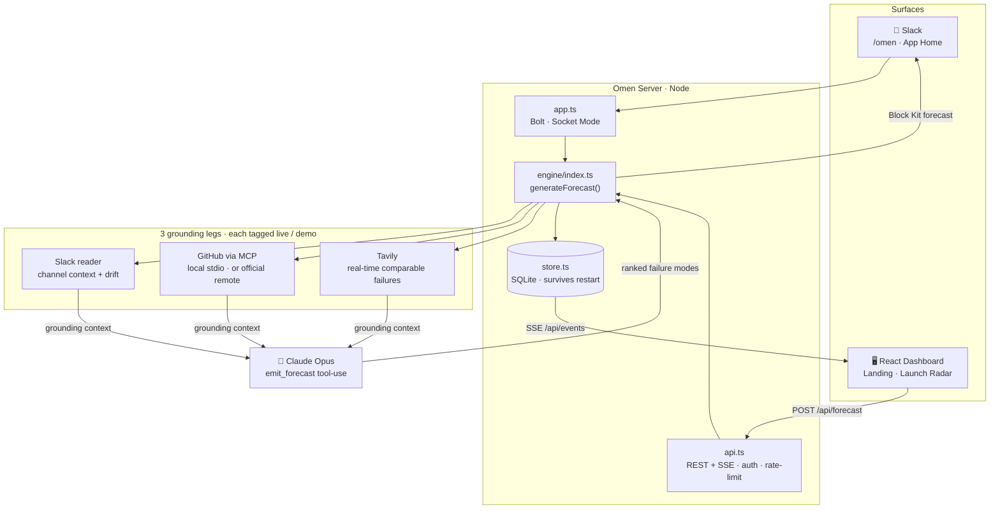

# 🔮 Omen

**Every launch sends omens before it breaks. Omen reads them.**

A Slack agent for the Slack Agent Builder Challenge. Before you ship, `/omen`
predicts *how this specific launch will fail* — as an evidence-cited failure
forecast grounded in your own history, not a generic checklist.

## Why it's different

| Existing tools | Omen |
|---|---|
| Delivery forecasters (Allstacks, LinearB) predict *when* you'll slip, from metrics | Predicts *how* you'll break, as a narrative |
| Postmortem tools (Rootly) explain *why*, after the outage | Warns *before* the launch ships |
| SRE/incident-scoped | Any team, any launch |

Unique wedge: the **drift → risk linkage** — it connects where your scope quietly
grew to the failure that growth will cause.

## Technologies

Omen uses **two of the three** required hackathon technologies for real, plus Slack
as its surface. We're deliberate about which is which:

- **MCP server integration (GitHub)** — a real Model Context Protocol server
  (`mcp/github-server.ts`, stdio transport) exposes the org's GitHub history as an
  MCP tool. The grounding engine connects as an MCP *client* and calls it over the
  protocol — GitHub grounding genuinely flows through MCP, not a direct REST call.
- **Real-time search API (Tavily)** — live web search for how comparable launches
  and migrations failed at other companies.
- **Slack** — the agent's home: reads channel history for context, posts the
  forecast, App Home dashboard. The *AI reasoning itself is Claude* — we don't
  dress up Slack data access as "Slack AI."

## Architecture



The **drift → risk linkage** is the signature move: the Slack reader detects scope
additions, and Claude ties each one to the specific failure mode it will cause.

<details>
<summary><b>File layout</b></summary>

```
server/src/
  types.ts            # FailureForecast contract — the spine
  mcp/
    github-server.ts  # real MCP server (stdio) exposing GitHub as a tool
    github-client.ts  # MCP client the engine uses to call it (local or remote)
  engine/
    grounding.ts      # gather context: Slack + GitHub(MCP) + Tavily search
    forecast.ts       # Claude (claude-opus-4-8) → ranked, cited failure modes
    index.ts          # orchestrator: generateForecast()
    fixtures.ts       # demo seed / offline fallback
  render/blocks.ts    # Block Kit: readiness score + failure cards
  store.ts            # SQLite persistence + SSE broadcast hook
  api.ts              # REST + SSE feed for the dashboard (auth, CORS, rate-limit)
  app.ts              # Bolt (Socket Mode): /omen command
web/                  # React dashboard (routing, live SSE, readiness gauge)
```
</details>

## Run it

```bash
# Terminal 1 — Slack bot (Socket Mode) + dashboard API
cd server
npm install
cp .env.example .env       # fill in keys (see below); works without them via demo seed
npm run dev                # Bolt on :3000, REST/SSE API on :3001
npm test                   # unit tests for the scoring + diff logic

# Terminal 2 — dashboard
cd web
npm install
cp .env.example .env
npm run dev                # http://localhost:5173
```

Every grounding leg degrades to demo seed if its key is missing, and the UI
labels each leg **live** or **demo** — so a partially-configured run still works
and never passes seed data off as real. The dashboard/API boots even if Slack
credentials are absent.

**Keys and what they unlock** (all optional; more = more legs go live):
| Key | Unlocks |
|-----|---------|
| `ANTHROPIC_API_KEY` | Live forecast synthesis (else seeded forecast) |
| `SLACK_BOT_TOKEN` + `SLACK_APP_TOKEN` + `SLACK_SIGNING_SECRET` | The `/omen` command + App Home |
| `GITHUB_TOKEN` + `GITHUB_REPO` | GitHub grounding **via MCP** |
| `TAVILY_API_KEY` | External comparable failures **via real-time search** |
| `SLACK_USER_TOKEN` | (optional) Slack message search |

---

## 🎬 Demo run-of-show (submission video)

**The 10-second pitch (say this first):**
> *"Every launch tool tells you **when** you'll slip or **why** you failed after the outage. Omen tells you **how your specific launch will die — before it ships** — grounded in your own GitHub incidents and real-time comparable failures, right inside Slack."*

**Pre-warm (before you hit record):**
1. `cd server && npm run dev` — wait for `🔮 Omen is watching`. Confirm the log shows real legs, e.g. `Search: 4 results (4 Tavily…)`.
2. `cd web && npm run dev` — open `http://localhost:5173`. The **Launch Radar** shows the 3 seeded forecasts (readiness 28 / 61 / 79). The nav dot reads **Live**.
3. In Slack, run `/omen Payments v2 launch` **once now** so the real forecast is cached. Live synthesis takes ~30s — you do **not** want that dead air on camera. (Leave the result in the channel.)
4. Have two windows side by side: **Slack** (left) and the **dashboard** (right).

**On camera (~90 seconds):**

| # | Do | Say |
|---|----|-----|
| 1 | Show the dashboard **Launch Radar** with 3 forecasts, gauges filled | *"Omen watches launches and scores how likely each is to break."* |
| 2 | Click **Payments v2 launch** → detail view | *"It doesn't summarize — it predicts specific failure modes."* |
| 3 | Point at the **grounding chips** (Slack · GitHub/MCP · Search, green = live) | *"Grounded in this team's own GitHub incidents and live web search for how comparable migrations failed — MCP and real-time search, both live."* |
| 4 | Point at **⚠️ Scope drift** → the top failure mode | *"It caught that SSO crept into a payments-only launch — and ties that drift to the exact outage it'll cause, citing the team's own March 14 incident."* |
| 5 | Click through the **Saboteur / Customer / Pessimist** tabs | *"Three adversarial lenses — the Pessimist names the org dysfunction nobody will say out loud."* |
| 6 | Switch to **Slack**, show the cached `/omen Payments v2 launch` result | *"Same forecast lives where the team already works."* |
| 7 | Back on the dashboard, click **🔄 Re-run** (on the pre-warmed one for speed) | *"Re-run after mitigations and it diffs the readiness score — so you can watch risk drop before you ship."* |
| 8 | Scroll to the bottom of the detail view, click **📋 Copy forecast as markdown** | *"One click exports the full forecast — failure modes, evidence, mitigations — ready to paste into a doc, ticket, or incident review."* |

**Closer:**
> *"PagerDuty and Rootly clean up after the fire. Omen stops you from lighting it."*

**Gotchas**
- Live `/omen` ≈ 30s (Claude Opus). Always pre-warm; on camera use **Re-run** on an already-cached forecast, or narrate over the seeded cards.
- If a chip shows **demo**, that key isn't set — fine for a dry run, but set `TAVILY_API_KEY` + `GITHUB_TOKEN`/`GITHUB_REPO` before the real take so Search + MCP show **live**.

---

## Status — shipped

- [x] M0–M4 — full pipeline: `/omen`, live grounding, interactive Block Kit, React dashboard, personas + diff + seed
- [x] Real **MCP server/client** for GitHub grounding · Real **Tavily** real-time search
- [x] Provenance (live/demo) across Slack + web · interactive dashboard (New forecast / Re-run)
- [x] Unit tests (`npm test`) · gauge + branding + layout polish
